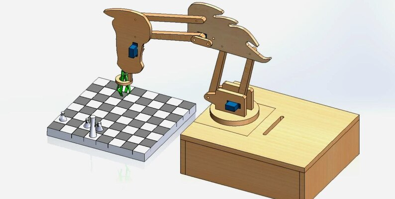

# WCRA-AI
Graduation Project repo.

This repo will contain some info and code to my graduation project,
WCRA-AI ===> "Wireless Chess Robotic Arm based on Artificial Intelligence"

## About the Project

  
Developed a cutting-edge Wireless Chess Robotic Arm (WCRA-AI) capable of playing
chess autonomously. This project was an interesting application in fields like embedded systems, AI,
and IoT. The project utilized advanced technologies such as computer vision, convolutional neural
networks, and the Internet of Things (IoT) to create a robot that can make strategic decisions in a
dynamic environment. The robotic arm, controlled over a wireless network, was designed not only for
chess playing but also for potential applications in pick-and-place operations. The arm incorporated
servo motors controlled by an Arduino. A camera placed above the chessboard, connected to a
Raspberry Pi, processed the captured image using various programs and functions. Powered by a
**CNN model** the image was converted into chess notation describing the game's position, which was
then sent to a chess engine powered by the **NegaMax algorithm** on the Raspberry Pi for move
selection. Raspberry Pi and Arduino are connected by i2c connection to move the arm by the selected
chess move. In multiplayer mode, the notation was transmitted to the opponent via a web page hosted
on a server simulating as opponent's robot arm.

### Project block diagra

many thanks to my friends and colleagues for their hard work and finishing the project perfectly, It was tough. 
  
[Ahmed Sabry Lilah](https://www.linkedin.com/in/ahmed-sabry-liah)  
Alyaa Mosaad Sherif 
[Moataz Mohammed Ibrahim](https://www.linkedin.com/in/moataz-towfik-012a5a238)        
Mohamed Ashraf Ali 
[Mohamed Moataz Moustafa](https://www.linkedin.com/in/mohamed-moataz) (thats me) 
[Mostfa Hisham Abd Elgawad](https://www.linkedin.com/in/mostafa-hesham-6395a1218?utm_source=share&utm_campaign=share_via&utm_content=profile&utm_medium=android_app) 
​

and spetial thanks to our Supervisor  
Dr.Mohammed El-Sayed Ali Hammad. 

I also should thank [Dr.refaat AbouZaid](https://www.youtube.com/@dr_refaatabouzaid1039)  for his help and supoort during the project. 
and my colleague that was Supporting us morally despite not being in the team, Thank you shimaa el-ket. 

Discussion date : 2 / 7 / 2022 at 
[Higher Institute of Engineering and Technology in Tanta. (THIET)](https://thiet.edu.eg/ar)

 

